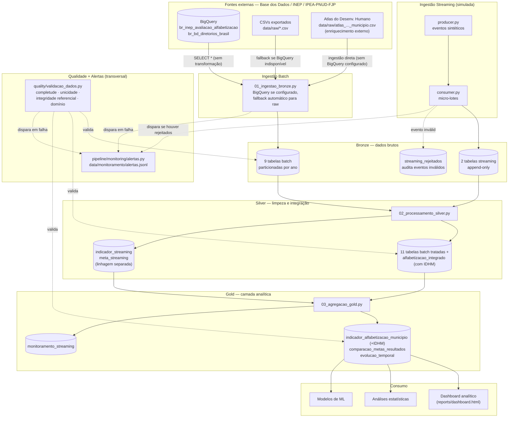
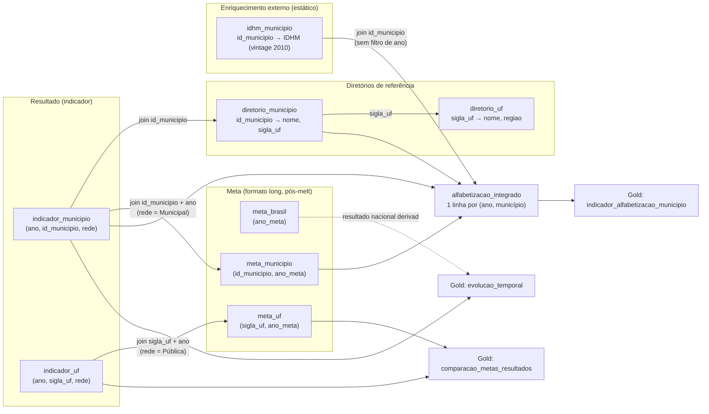

# Arquitetura da Pipeline

Diagramas de referência para o Tech Challenge — Pipeline Híbrido para Análise
da Alfabetização no Brasil. Renderizam nativamente no GitHub (blocos ` ```mermaid `).

## 1. Arquitetura geral (Medalhão + ingestão híbrida)



**Por que ingestão híbrida com fallback, não só BigQuery:** o BigQuery exige um
projeto GCP com faturamento ativo e credenciais válidas — indisponível neste
ambiente de desenvolvimento. `01_ingestao_bronze.py` tenta o BigQuery primeiro
(produção) e cai automaticamente para os CSVs de `data/raw/` (o mesmo dado,
exportado manualmente uma vez) sem exigir intervenção manual — o restante da
pipeline (Silver, Gold, qualidade) roda idêntico em ambos os caminhos.

**Por que o streaming vira uma linhagem separada, não se junta ao batch:** os
eventos de streaming são sintéticos (gerados por `producer.py` para demonstrar
o padrão de ingestão incremental), não o resultado oficial do INEP. Misturá-los
em `alfabetizacao_integrado` contaminaria a análise real com números fabricados
— por isso seguem até a Gold só como `monitoramento_streaming` (volume,
cobertura, latência), nunca como dado analítico.

**Por que eventos de streaming inválidos são auditados, não descartados:**
antes, um evento que falhasse na validação de schema só aparecia no log da
execução ao vivo — sem persistência, não dava para investigar depois. Agora
`consumer.py` grava o payload bruto + motivo em `streaming_rejeitados`
(Bronze), e dispara um alerta (`pipeline/monitoring/alertas.py`) ao final da
execução se houve algum. O alerta fica em `data/monitoramento/alertas.jsonl`,
junto com os disparados por falhas de ingestão/processamento/agregação e por
alertas de qualidade de dados — um log append-only consultável depois que a
execução termina, sem depender de um canal externo (e-mail/Slack) configurado.

**Por que o IDHM entra como enriquecimento estático, não por ano:** o Índice
de Desenvolvimento Humano Municipal depende do Censo Demográfico do IBGE
(decenal) — a vintage mais recente com apuração oficial é 2010. Diferente do
indicador de alfabetização (anual), o IDHM não tem uma linha por ano; por isso
entra como LEFT JOIN por `id_municipio` (sempre a vintage 2010) em
`alfabetizacao_integrado`, cobrindo 99,9% dos municípios avaliados.

## 2. Fluxo de dados — de que tabela vem cada join da Gold



**Decisão de modelagem que este diagrama evidencia:** `indicador_municipio` e
`indicador_uf` trazem mais de uma linha por (ano, entidade) — uma por rede de
ensino (Municipal, Estadual, Pública=agregado, ...). A Silver escolhe, para
cada município/UF, o resultado "headline" pela rede de maior prioridade
disponível (Pública > Municipal > Estadual > Privada > Total), mas a
**comparação com a meta usa especificamente a rede em que a meta foi
definida** — Municipal para `meta_municipio`, Pública para `meta_uf`/`meta_brasil`
— para não misturar escopos diferentes no cálculo do gap. Não existe uma tabela
de resultado nacional própria no dataset de origem; a série Brasil é derivada
da coluna `taxa_alfabetizacao` já presente em `meta_brasil` (o resultado
observado no ano de referência de cada vintage da meta).

Ver `notebooks/02_pipeline_bronze_silver.ipynb` para um exemplo executado com
dado real dessa decisão (caso "Americana/SP").
