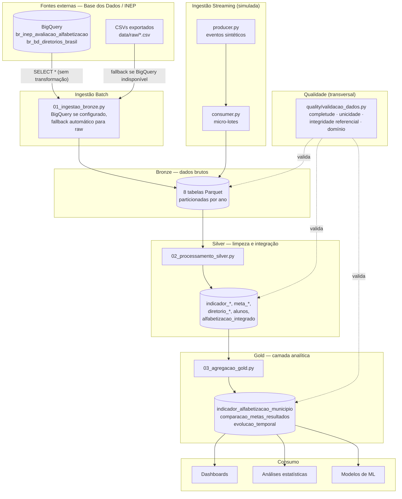
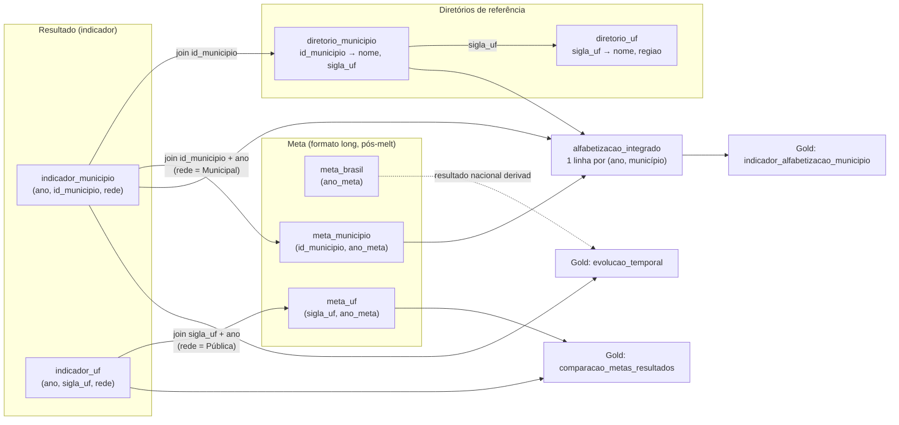

# Arquitetura da Pipeline

Diagramas de referência para o Tech Challenge — Pipeline Híbrido para Análise
da Alfabetização no Brasil. Renderizam nativamente no GitHub (blocos ` ```mermaid `).

## 1. Arquitetura geral (Medalhão + ingestão híbrida)



**Por que ingestão híbrida com fallback, não só BigQuery:** o BigQuery exige um
projeto GCP com faturamento ativo e credenciais válidas — indisponível neste
ambiente de desenvolvimento. `01_ingestao_bronze.py` tenta o BigQuery primeiro
(produção) e cai automaticamente para os CSVs de `data/raw/` (o mesmo dado,
exportado manualmente uma vez) sem exigir intervenção manual — o restante da
pipeline (Silver, Gold, qualidade) roda idêntico em ambos os caminhos.

## 2. Fluxo de dados — de que tabela vem cada join da Gold



**Decisão de modelagem que este diagrama evidencia:** `indicador_municipio` e
`indicador_uf` trazem mais de uma linha por (ano, entidade) — uma por rede de
ensino (Municipal, Estadual, Pública=agregado, ...). A Silver escolhe, para
cada município/UF, o resultado "headline" pela rede de maior prioridade
disponível (Pública > Municipal > Estadual > Privada > Total), mas a
**comparação com a meta usa especificamente a rede em que a meta foi
definida** — Municipal para `meta_municipio`, Pública para `meta_uf`/`meta_brasil`
— para não misturar escopos diferentes no cálculo do gap. Não existe uma tabela
de resultado nacional própria no dataset de origem; a série Brasil é derivada
da coluna `taxa_alfabetizacao` já presente em `meta_brasil` (o resultado
observado no ano de referência de cada vintage da meta).

Ver `notebooks/02_pipeline_bronze_silver.ipynb` para um exemplo executado com
dado real dessa decisão (caso "Americana/SP").
